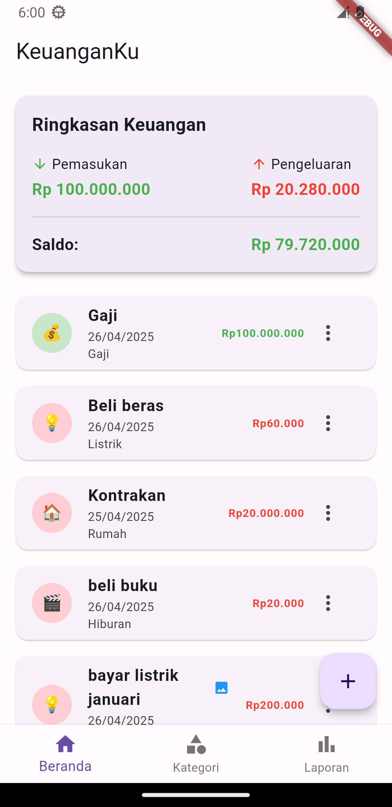
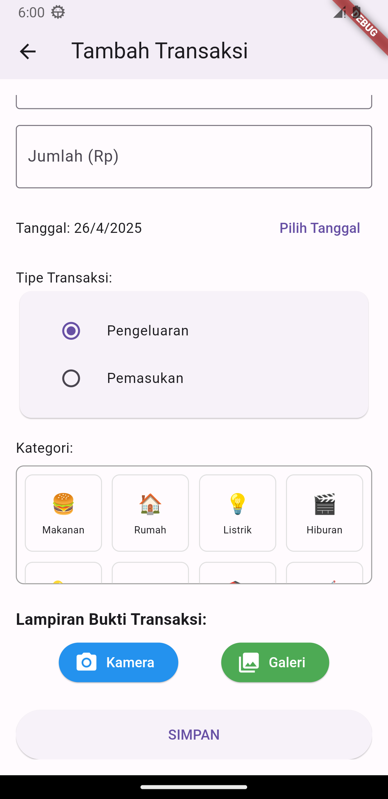
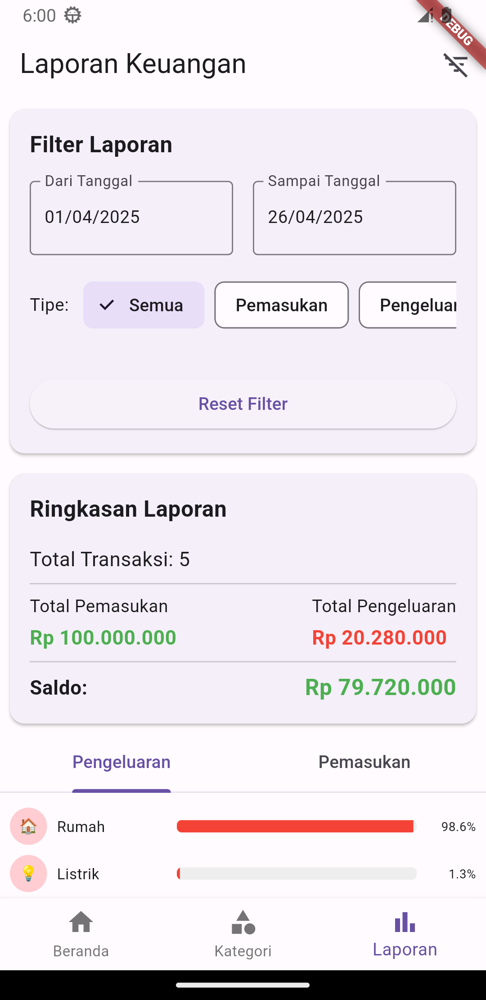

# KeuanganKu - Aplikasi Pengelola Keuangan Pribadi

  

  

## 📱 Tentang Aplikasi

**KeuanganKu** adalah aplikasi pengelola keuangan pribadi yang dirancang untuk membantu Anda melacak pemasukan dan pengeluaran dengan mudah. Aplikasi ini dibangun menggunakan Flutter dengan pendekatan Clean Architecture dan Provider untuk state management.

## ✨ Fitur Utama

### 📊 Dashboard Beranda
Melihat ringkasan keuangan dan daftar transaksi terbaru dengan tampilan yang intuitif.

  

### 💰 Pencatatan Transaksi
Catat pemasukan dan pengeluaran dengan detail lengkap termasuk kategori, tanggal, dan lampiran bukti transaksi.

  

### 🔍 Detail Transaksi
Lihat detail lengkap setiap transaksi dan edit jika diperlukan.

### 📁 Lampiran Bukti Transaksi
Lampirkan gambar sebagai bukti transaksi baik untuk pemasukan maupun pengeluaran.

### 📋 Pengelolaan Kategori
Kelola kategori transaksi untuk mengorganisir keuangan dengan lebih baik.

  
  

### 📈 Laporan Keuangan
Analisis keuangan dengan laporan visual berdasarkan kategori dan periode waktu.

  

## 🛠️ Teknologi yang Digunakan

- **Flutter**: Framework UI untuk pengembangan aplikasi multi-platform
- **Provider**: State management
- **SharedPreferences**: Penyimpanan data lokal berbasis key-value
- **Clean Architecture**: Arsitektur aplikasi untuk pemisahan tanggung jawab
- **Repository Pattern**: Pola desain untuk akses data
- **Dependency Injection**: Untuk manajemen dependensi
- **Image Picker**: Untuk mengambil gambar dari kamera atau galeri
- **Path Provider**: Untuk mengakses penyimpanan lokal

## 🚀 Cara Menjalankan Aplikasi

1. Pastikan Flutter SDK sudah terinstal di komputer Anda
2. Clone repositori ini
3. Jalankan `flutter pub get` untuk menginstal dependensi
4. Jalankan `flutter run` untuk memulai aplikasi

## 📝 Fitur yang Akan Datang

- Ekspor data ke format Excel/PDF
- Pengaturan anggaran bulanan
- Notifikasi pengingat pembayaran
- Sinkronisasi data ke cloud
- Tema gelap (dark mode)
- Dukungan multi-bahasa

## 📄 Lisensi

Aplikasi ini bersifat open source dan tersedia di bawah lisensi MIT.

---

  Dibuat dengan ❤️ untuk membantu pengelolaan keuangan pribadi yang lebih baik

